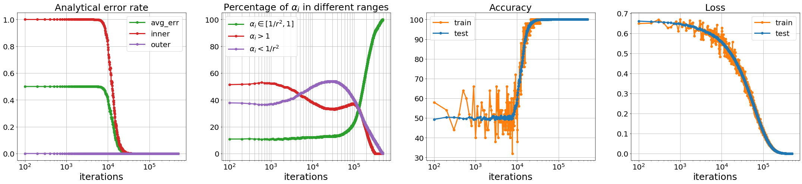
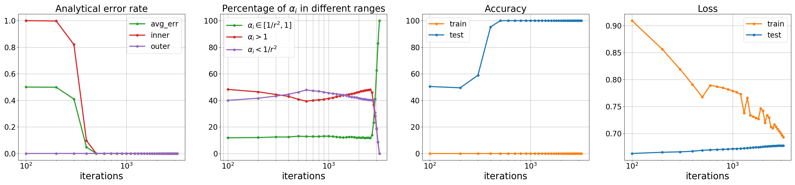
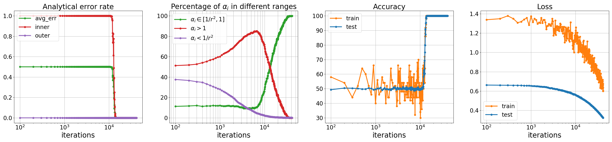

# Adversarial spheres

Pytorch implementation [Adversarial Spheres][paper-link].

## Requiresments
```
pytorch 1.2.0
python 3.6.0
tensorflow
tqdm
numpy 1.15.0
```

## How to run

* regular training:
```bash
$ python main.py --method clean
```

* train with worst case loss
```bash
$ python main.py --method truemax
```

* adversarial training with PGD attacks
```bash
$ python main.py --method adv --pgd_alpha 0.1 --pgd_itr 10
```

### Standard training


### Training with the exact maximizer of the inner-max optimization


### Adversarial training with PGD examples


## Some minor typos in paper
Here I notice a few typos in the original paper. They are very minor and will not affect the overal understanding of the paper, but they do matter for reproducibility.
- In Equation 3, Analytic error rate on the inner sphere should be: </br>
.)

- Right above Equation 3, the variance is missing a square sign: </br>
^{2}.)

- The Gaussian distribution in the caption of Figure F5 should be: </br>
.)


## Discussions

## Others
Please cite the following paper for Adversarial spheres:

```
@inproceedings{46623,
title	= {Adversarial Spheres},
author	= {Justin Gilmer and Luke Metz and Fartash Faghri and Sam Schoenholz and Maithra Raghu and Martin Wattenberg and Ian Goodfellow},
year	= {2018},
URL	= {https://arxiv.org/pdf/1801.02774.pdf}
}
```

## Contact
If you have any questions or suggestions, please feel free to contact me via ama at cs dot toronto dot edu!


[paper-link]: <https://arxiv.org/abs/1801.02774>

